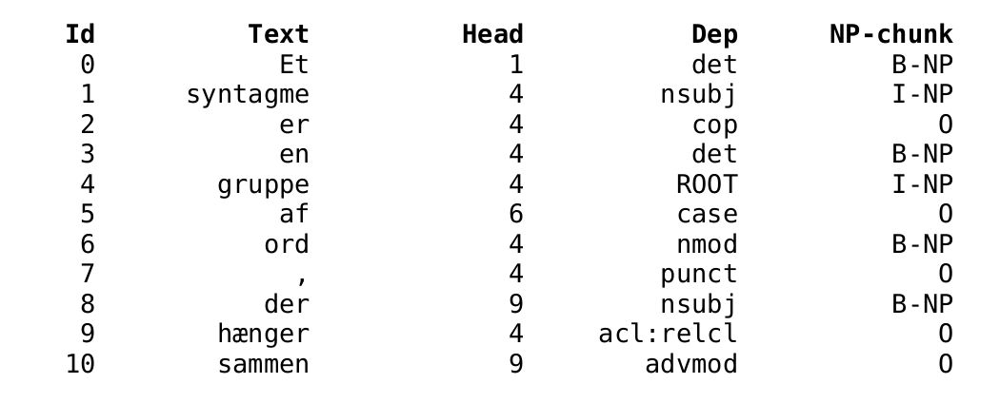

Dependency Parsing & Noun Phrase Chunking
=========================================

### Dependency Parsing

Dependency parsing is the task of extracting a dependency parse of a sentence. 
It is typically represented by a directed graph that depicts the grammatical structure of the sentence; where nodes are words and edges define syntactic relations between those words. 
A dependency relation is a triplet consisting of: a head (word), a dependent (another word) and a dependency label (describing the type of the relation).


| Model | Train Data | License | Trained by | Tags | DaNLP |
|-------|-------|-------|-------|-------|-------|
| [SpaCy](https://github.com/alexandrainst/danlp/blob/master/docs/models/dependency.md#spacy) | [Danish Dependency Treebank](<https://github.com/alexandrainst/danlp/blob/master/docs/datasets.md#danish-dependency-treebank-dane>) | MIT | Alexandra Institute | 17  Universal dependencies | ✔️ |


The model has been trained on the Danish UD treebank which have been annotated with dependencies following the [Universal Dependency](https://universaldependencies.org/u/dep/index.html) scheme.
It uses 39 dependency relations.

### Noun Phrase Chunking

Chunking is the task of grouping words of a sentence into syntactic phrases (e.g. noun-phrase, verb phrase). 
Here, we focus on the prediction of noun-phrases (NP). Noun phrases can be pronouns (`PRON`), proper nouns (`PROPN`) or nouns (`NOUN`)  -- potentially bound with other tokens that act as modifiers, e.g., adjectives (`ADJ`) or other nouns. 
In sentences, noun phrases are generally used as subjects (`nsubj`) or objects (`obj`) (or complements of prepositions).
Examples of noun-phrases :
 * en `bog` (NOUN)
 * en `god bog` (ADJ+NOUN)
 * `Lines bog` (PROPN+NOUN)

NP-chunks can be deduced from dependencies. 
We provide a convertion function -- from dependencies to NP-chunks -- thus depending on a dependency model.


## :wrench:SpaCy

Read more about the SpaCy model in the dedicated [SpaCy docs](<https://github.com/alexandrainst/danlp/blob/master/docs/spacy.md>) , it has also been trained using the [Danish Dependency Treebank](<https://github.com/alexandrainst/danlp/blob/master/docs/datasets.md#danish-dependency-treebank-dane>) dataset. 

### Dependency Parser

Below is a small getting started snippet for using the SpaCy dependency parser:

```python
from danlp.models import load_spacy_model

# Load the dependency parser using the DaNLP wrapper
nlp = load_spacy_model()

# Using the spaCy dependency parser
doc = nlp('Ordene sættes sammen til meningsfulde sætninger.')

dependency_features = ['Id', 'Text', 'Head', 'Dep']
head_format = "\033[1m{!s:>11}\033[0m" * (len(dependency_features) )
row_format = "{!s:>11}" * (len(dependency_features) )

print(head_format.format(*dependency_features))
# Printing dependency features for each token 
for token in doc:
    print(row_format.format(token.i, token.text, token.head.i, token.dep_))
```


#### Visualizing the dependency tree with SpaCy

```python
# SpaCy visualization tool
from spacy import displacy

# Run in a terminal 
# In jupyter use instead display.render 
displacy.serve(doc, style='dep')
```


`nsubj`: nominal subject, 
`advmod`: adverbial modifier, 
`case`: case marking, 
`amod`: adjectival modifier, 
`obl`: oblique nominal, 
`punct`: punctuation


### Chunker 

Below is a snippet showing how to use the chunker: 

```python
from danlp.models import load_spacy_chunking_model

# text to process
text = 'Et syntagme er en gruppe af ord, der hænger sammen'

# Load the chunker using the DaNLP wrapper
chunker = load_spacy_chunking_model()
# Using the chunker to predict BIO tags
np_chunks = chunker.predict(text)

# Using the spaCy model to get linguistic features (e.g., tokens, dependencies) 
# Note: this is used for printing features but is not necessary for processing the chunking task
nlp = chunker.model
doc = nlp(text)

syntactic_features=['Id', 'Text', 'Head', 'Dep', 'NP-chunk']
head_format ="\033[1m{!s:>11}\033[0m" * (len(syntactic_features) )
row_format ="{!s:>11}" * (len(syntactic_features) )

print(head_format.format(*syntactic_features))
# Printing dependency and chunking features for each token 
for token, nc in zip(doc, np_chunks):
    print(row_format.format(token.i, token.text, token.head.i, token.dep_, nc))
```



## 📈 Benchmarks

See detailed scoring of the benchmarks in the [example](<https://github.com/alexandrainst/danlp/tree/master/examples>) folder.

### Dependency Parsing

Dependency scores — LA (labelled attachment score), UAS (Unlabelled Attachment Score) and LAS (Labelled Attachment Score) — are reported below :

| Model | LA    | UAS   | LAS   |
|-------|-------|-------|-------|
| SpaCy | 87.68 | 81.36 | 77.46 |

### Noun Phrase Chunking

NP chunking scores (F1) are reported below :

| Model | Precision | Recall | F1    |
|-------|-----------|--------|-------|
| SpaCy | 91.32     | 91.79  | 91.56 |

